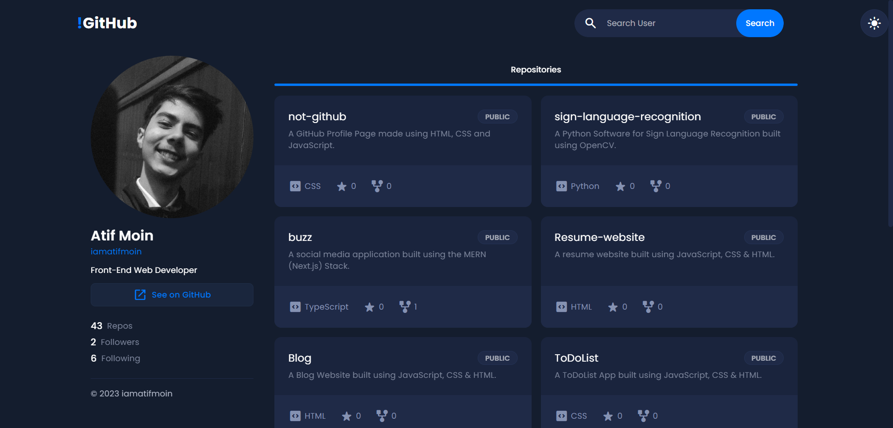
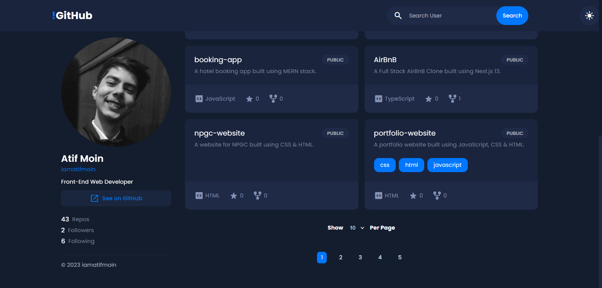

# !GitHub

A GitHub Repository Listing Page made using HTML, CSS, JavaScript and GitHub REST APIs.

## Features

- Search GitHub Users
- View Profile
- View Public Repositories
- Skeleton Loaders
- Selected Number of Repositories to Display Per Page
- Server Side Pagination

## Screenshots





## Setup Locally

Clone the Project

```bash
  git clone https://github.com/iamatifmoin/not-github.git
```

Go to the Project Directory

```bash
  cd not-github
```

Open with VSCode

```bash
  code .
```

Run with Live Server

```bash
  live-server
```
